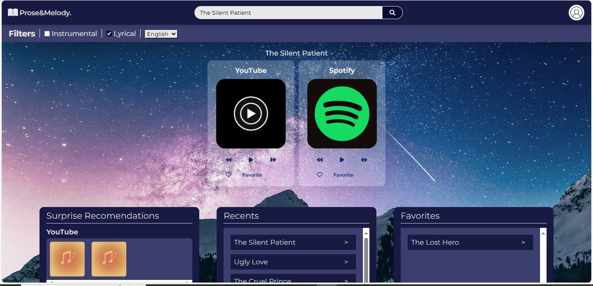
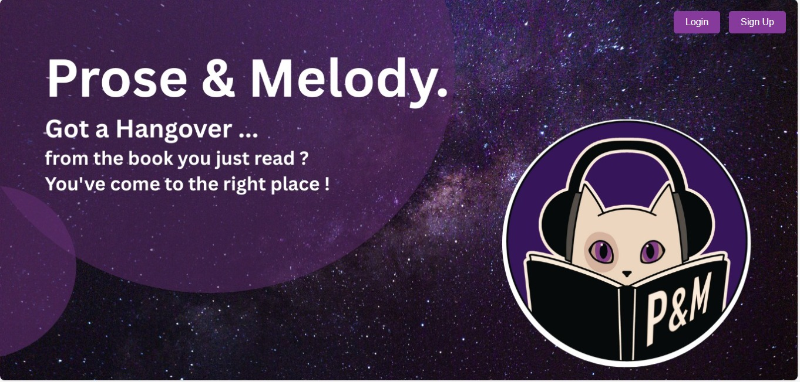

# Book-to-Music Recommendation System

A full-stack project that recommends music playlists based on the genre and mood of a book. It combines **content-based filtering** and **SVD-based collaborative filtering** to suggest Spotify and YouTube Music genres tailored to the user's reading preferences.

---

## Overview

This system aims to enhance a reader's experience by pairing books with suitable music. The recommendation pipeline uses:

- **Content-Based Filtering** – Matches book genres with predefined music genres using a curated dataset.
- **Collaborative Filtering (Truncated SVD)** – Analyzes user preferences and recommends music genres based on patterns across users.

---

## Technologies Used

### Backend:
- **Flask** – Python web framework
- **MongoDB** – Database for storing user preferences, genres, and history
- **Truncated SVD (Scikit-Learn)** – For collaborative filtering
- **NumPy & Pandas** – Data manipulation and matrix operations

### Frontend:
- **HTML/CSS/JavaScript** – User interface
- **Fetch API** – For client-server communication

---

## 🔄 Recommendation Flow

1. User enters a book title.
2. Book genre is fetched via OpenLibrary API.
3. Genre is matched to music moods using a content-based mapping.
4. The matched genres are passed into a collaborative filtering model (SVD).
5. Recommendations are refined using similar user patterns.
6. Final music genres are used to fetch Spotify and YouTube playlists.

---

## 📊 Algorithms Used

- **Content-Based Filtering** – Uses predefined relationships between book and music genres.
- **Truncated SVD** – Decomposes the user-genre matrix to find hidden patterns and similarities across users.
- **Correlation Matrix** – Used to find similar users.

---

## 👥 Team Members

This project was collaboratively developed by a team of 4:

-[@Muskan Tarafder](https://github.com/Muskan-Tarafder)
-[@Rhyah M](https://github.com/rhy321)
-[@Tanvi Sanjay Patil](https://github.com/TanviPatil1502)
-[@Prajna Nayak](https://github.com/prajna-17)

---

## License

This project is **not licensed for reuse or distribution**.

> All rights reserved by the authors.  
> Please do not copy, redistribute, or modify any part of this project without prior written permission.

---

## Screenshots 






---

## 📁 Folder Structure

```plaintext
PandM/
├── Backend/
│   ├── app.py               # Flask application entry point
│   ├── MainCode.py          # Main logic: SVD, MongoDB, recommendations
│   └── book_to_music.py     # Content-based filtering logic
│
├── dataset/
│   └── book_genres.py       # Reference document for book genres
│
├── .env                     # Environment variables (not shared)
│
├── Frontend/
│   ├── static/
│   │   ├── images/          # UI images
│   │   ├── js/              # JavaScript files
│   │   └── style/           # CSS files
│   └── templates/           # HTML templates
│
└── README.md                # Project overview and instructions
```
